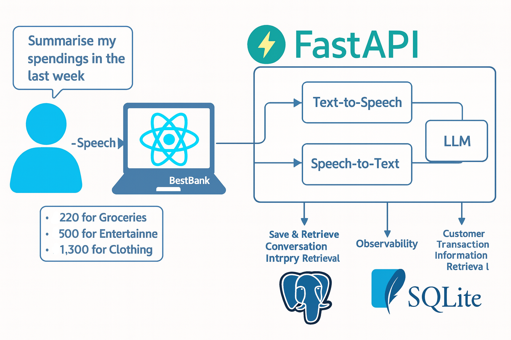
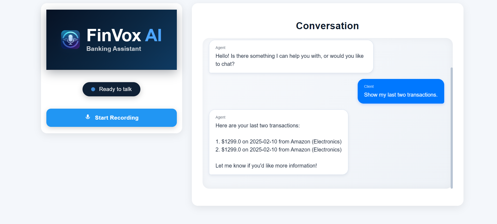

## FinVox AI

 

FinVox AI Voice Assistant is a fully intelligent, real-time Voice-to-Voice Banking Assistant that allows users to interact with their banking data through natural spoken conversations.

Built with a modern AI stack, WebSockets, FastAPI, React, and advanced Speech-to-Text & Text-to-Speech engines, FinVox transforms the traditional banking experience into a hands-free, personalized, conversational interface.

### What Problem Does It Solve?

Banks still rely heavily on text-based or UI-heavy dashboards. Users often struggle to quickly find:

- No need to search through pages of banking data  
- Eliminates UI-heavy and complex dashboards  
- Allows users to get insights quickly with just **their voice**  
- Supports smarter personal finance decision-making  

###  Why It’s Innovative
- Real-time WebSocket-based voice streaming  
- AI agent capable of financial reasoning  
- Full-stack STT → Intent → Analytics → TTS pipeline  
- Observability-first architecture  
- Hackathon-ready modular codebase  

---

# High-Level Architecture



## Architecture Explained

### 1️ Frontend (React + TypeScript)
- Captures mic input  
- Streams audio to backend  
- Displays chat + plays responses  

### 2️ WebSocket Layer  
- Real-time streaming  
- Low-latency voice communication  

### 3️ FastAPI Backend  
- Handles STT → AI Agent → DB → TTS pipeline  
- Async event-driven  

### 4️ AI Agent  
- Uses PydanticAI  
- Handles reasoning, querying, summarization  

### 5️ Databases  
- PostgreSQL (Docker) → Stores conversation history  
- SQLite → Contains sample transaction data  

### 6️ Observability  
- Logfire for monitoring + analysis  

---

# Workflow



###  Voice Processing Pipeline
1. User speaks  
2. Audio streamed → WebSocket  
3. Groq STT converts speech → text  
4. AI Agent interprets request  
5. Queries run on SQLite database  
6. AI formats structured response  
7. OpenAI TTS converts text → voice  
8. UI plays the voice output  
9. Conversation saved to PostgreSQL  

---

### Frontend

Shows the sample UI. On the side users can optionally see the conversation history.


### Project Structure

```shell
├── docker-compose.yaml # For conversation history db
├── Makefile # Used for ease of setup
├── env.sample
└── src/
    ├── backend/ # FastAPI backend
    │   ├── ai_services/
    │   │   ├── agent.py
    │   │   ├── factories.py
    │   │   ├── tools.py
    │   │   └── utils.py
    │   ├── api/ # Dependencies for the WebSocket and the FastAPI Lifespan
    │   │   ├── dependencies.py
    │   │   └── lifespan.py
    │   ├── config/ # Configuration settings and credentials
    │   │   └── settings.py
    │   ├── convo_history_db/ # Postgres db utils
    │   │   ├── actions.py
    │   │   └── connection.py
    │   ├── customer_transaction_db/ # Sqlite db utils
    │   │   ├── connection.py
    │   │   └── transactions.db
    │   ├── nlp_processor/
    │   │   ├── speech_to_text.py
    │   │   └── text_to_speech.py
    │   ├── pyproject.toml
    │   ├── reset_db.py #Queries
    │   ├── server.py # Main FastAPI server
    │   ├── tests/
    └── frontend/ # React frontend
        ├── package.json
        ├── public/
        ├── README.md
        └── src/
            ├── App.css
            ├── App.tsx # Main app
            ├── components/ # Helper components
            │   ├── ChatBox
            │   ├── Header
            │   ├── Recording
            │   └── Status
            ├── index.css
            ├── index.tsx
            ├── tests/
```

### Setup

- clone the repository
- run `make` in the terminal and follow the commands

```bash
Available targets:
  setup_backend   - Set up the backend environment and install dependencies
  backend         - Start the backend server
  test_backend    - Run backend tests
  setup_frontend  - Install frontend dependencies
  frontend        - Start the frontend development server
  test_frontend   - Run frontend tests
  database      - Start the database using Docker Compose
```


